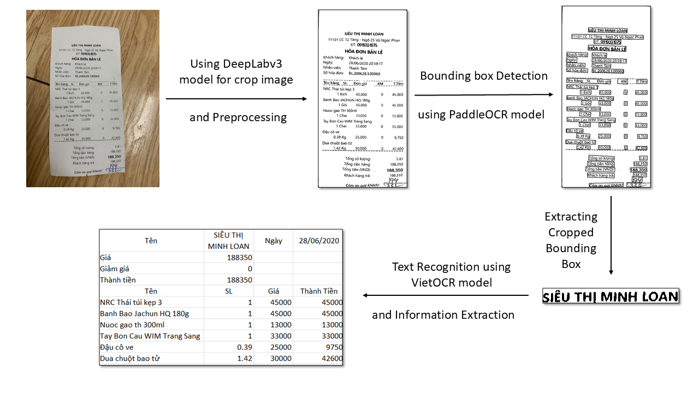

# Scan the Vietnamese invoice to extract the information.
This project utilizes the DeepLabv3 model to scan invoices and extract key information such as store name, invoice date, total amount, product list, etc. The information extraction process combines VietOCR (for reading Vietnamese text on invoices) and PaddleOCR (for detecting text regions on invoices).

### Notes
* Limitations in data processing:
  * Large images (e.g., 800x1000) or invoices without distortion deliver more accurate results.
  * Store names are not extracted accurately if written across two lines instead of a single line.

### Reference
1. [https://github.com/spmallick/learnopencv/tree/master/Document-Scanner-Custom-Semantic-Segmentation-using-PyTorch-DeepLabV3](https://github.com/spmallick/learnopencv/tree/master/Document-Scanner-Custom-Semantic-Segmentation-using-PyTorch-DeepLabV3)
2. [https://github.com/pbcquoc/vietocr/blob/master/vietocr_gettingstart.ipynb](https://github.com/pbcquoc/vietocr/tree/master)
